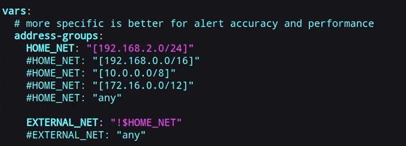

# Suricata Intigration (On UBUNTU) with Wazuh


## Install Suricata

Setup to install the latest stable Suricata:
```
sudo apt update
sudo apt-get install software-properties-common
sudo add-apt-repository ppa:oisf/suricata-stable
sudo apt-get update
```

Then, you can install the latest stable with:

`sudo apt-get install suricata`

## Control Suricata
```
sudo systemctl status suricata
sudo systemctl enable suricata
sudo systemctl start suricata
sudo systemctl stop suricata
```

## Configure Suricata
`sudo nano /etc/suricata/suricata.yaml`

### configure the ip address

- change the IP address of Home Net. 
<p align="center">
    
</p>

Also at af-packet , pcap:
- Choose the right interface.
- Make sure the cluster-ID is Unique.
- Make `community-it: true`  #important with zeek intigeration

(optionl): you can add custom rules.

**Testing the Configuration**

`sudo suricata -T -c /etc/suricata/suricata.yaml -v`

**Run in the background** 

`sudo suricata -D`

**The location of the logs**

/var/logs/suricata

 Testing the Suricata in Other Framework
---
https://github.com/3CORESec/testmynids.org

`curl http://testmynids.org/uid/index.html`


## Signatures
```
sudo suricata-update

sudo suricata-update list-sources //to see the list of sources for the rules updates

sudo suricata-update enable-source 'the-name-of-the-source'
```

## Upgrading Suricata
```
sudo apt-get update
sudo apt-get upgrade suricata
```
## Getting Debug or Pre-release Versions
`sudo apt-get install suricata-dbg`


## Reference
https://docs.suricata.io/en/suricata-8.0.1/install/ubuntu.html
