# part 1 :Setup the Environment

## Introduction:

We will install and configure thehive and wazuh Agent locally.

---

Also you can install them locally using Docker through this link:

Setup-thehive-and-shuffle-using-Docker 
https://medium.com/@h.anb/project-part-1-1-setup-the-environment-ab65296bc4ab

---
Installing the-hive project through this link https://hive.apache.org/docs/latest/admin/manual-installation/

- configuring the systems

## Configuration of the hive:

    cassandra configuration
    elastic search configuration
    the hive configuration

- Make sure , you use Root privileges

` nano /etc/cassandra/cassandra.yaml`

Choose your **cluster_name: “ Project”**
<p align="center">     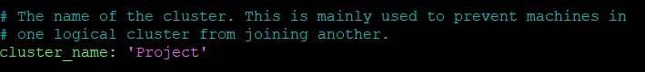 </p>

Put the **listen_address:** your public address.
<p align="center">     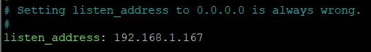 </p>

Put the **RPC_address**: Your public address.
<p align="center">     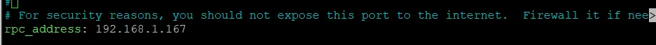 </p>

Put the **seeds**: “your public ip address:7000”
<p align="center">     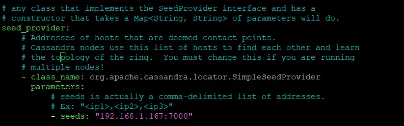 </p>

then save and exit.
```
systemctl stop cassandra.service
rm -rf /var/lib/cassandra/*           //remove the cassandra configuration to rebuild it when restarting 
systemctl start cassandra.service
systemctl status cassandra.service    //to make user the service is acitve
```
### Elastic search

`nano /etc/elasticsearch/elasticsearch.yml`

remove the hashtag and use your cluster.name.

<p align="center">     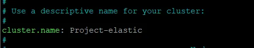 </p>

do the same thing with node.name
<p align="center">     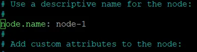 </p>

same with network.host (your public IP address)

<p align="center">     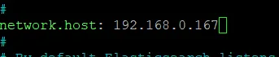 </p>
remove the hashtag from http.port
<p align="center">     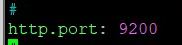 </p>

To start elastic-search you either need an initial cluster or discovery seed , we will use initial cluster and to scale out the elastic-search we will need discovery seed but we will not need that in this project. and remove the second node cause we need only one.

<p align="center">     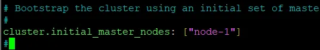 </p>

```
systemctl start elasticsearch
systemctl enable elasticsearch
systemctl status elasticsearch 
systemctl status cassandra.service //also make sure cassandra is active
```
### Configure the hive:
```
ls -la /opt/thp //that's the file path that thehive requires access to it (root)
chown -R thehive:thehive /opt/thp //to change from root to thehive user and group
```
now we can go to configure the configuration file for the hive

`nano /etc/thehive/application.conf`

we will put the public IP address in host-name as in the photo and also the cluster-name put it like the Cassandra cluster name.

<p align="center">     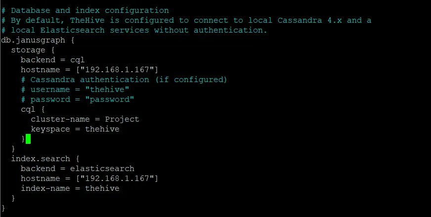 </p>

For the application.baseUrl ,put your public IP address and the port ,you want to access the hive with

<p align="center">     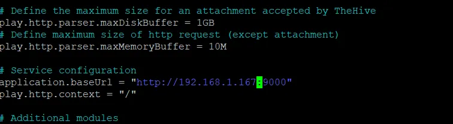 </p>

then save and exit.
```
systemctl start thehive
systemctl enable thehive
systemctl status thehive
```
    make sure Cassandra , elastic-search and the-hive are working.Now we can access the hive website on port 9000

default credential:

    username: admin@thehive.local
    pass: secret

<p align="center">     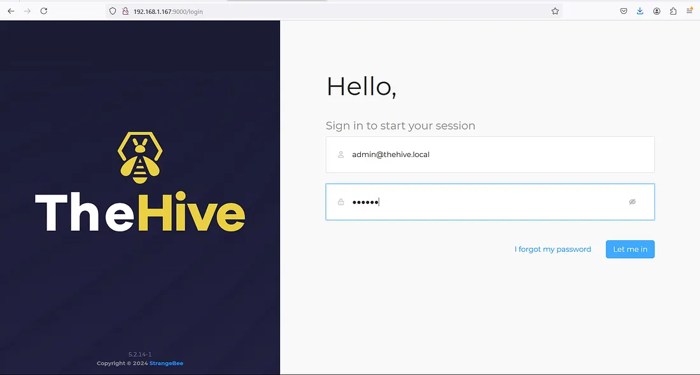 </p>
<p align="center">     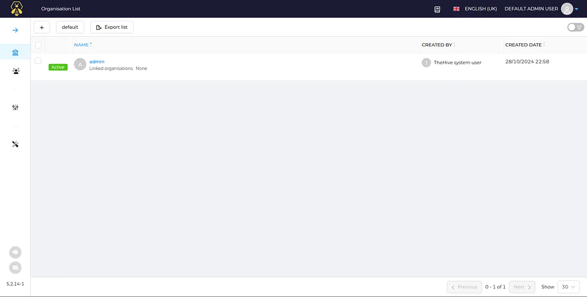 </p>

## Configuring the agent in windows 10:

at the server:

install wazuh using this command:

`curl -sO https://packages.wazuh.com/4.9/wazuh-install.sh && sudo bash ./wazuh-install.sh -a`

for more information use this website:
https://documentation.wazuh.com/current/quickstart.html?source=post_page-----7920cb899325---------------------------------------


You can find the passwords for all the Wazuh indexer and Wazuh API users in the `wazuh-passwords.txt` file inside `wazuh-install-files.tar`. To print them, run the following command:

`sudo tar -O -xvf wazuh-install-files.tar wazuh-install-files/wazuh-passwords.txt`

take the admin pass and the wazuh api user pass.

use admin and the admin pass to log into the wazuh server using this website. `https://yourpublic-IP`.

<p align="center">     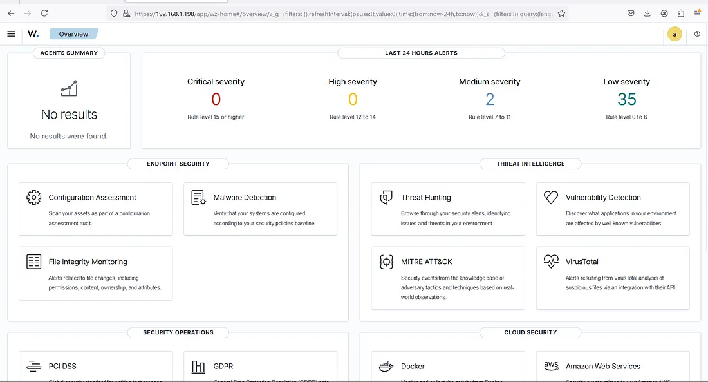 </p>

go to menu > server Managament > Endpoint Summary

<p align="center">     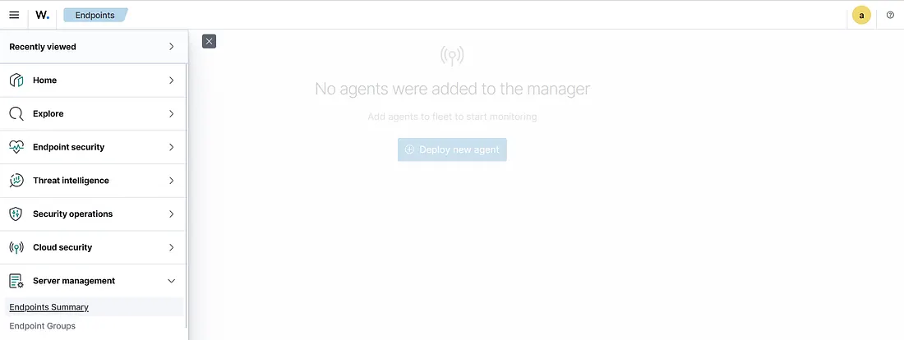 </p>

press deploy new agent

choose winodws and your server will be your public IP.

assign agent name is optional . choose the group name is default. then copy the command and paste it in powershell of the windows.

remember

- You will need administrator privileges to perform this installation.
- PowerShell 3.0 or greater is required.

<p align="center">     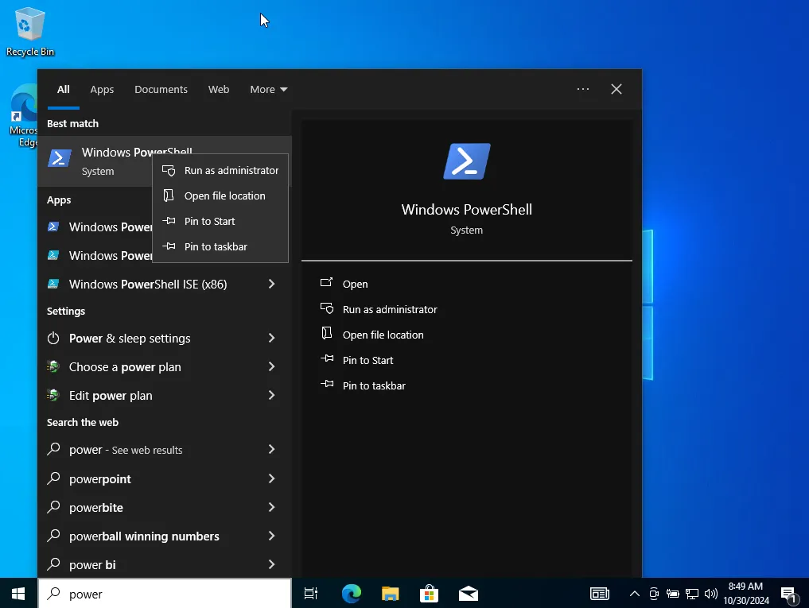 </p>

then execute this command:

`NET START WazuhSvc`

if it’s hard to copy and paste the command you can send the command using command line or you can type the powershell command . but i will teach you how to send it using powershell and bash.

in the server side:
```
echo "powershell command that you want to send " > command.txt
python3 -m http.server 8000 //to open http server on this port
python -m SimpleHTTPServer 8000 //or use this command if you don't have python3
```
in windows powershell:
```
Invoke-WebRequest -Uri http://publicIP:8000 -OutFile "choose the directory with the file name"
type filename //to read the file.
```
execute the command and then execute

`NET START WazuhSvc`

<p align="center">     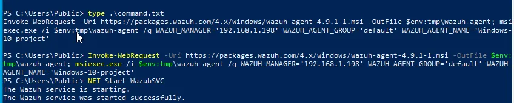 </p>

then check the server :

<p align="center">     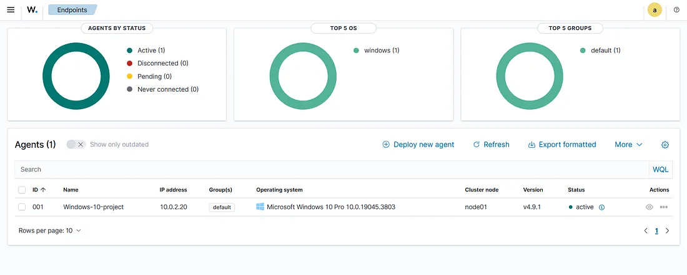 </p>

now every thing configured .
