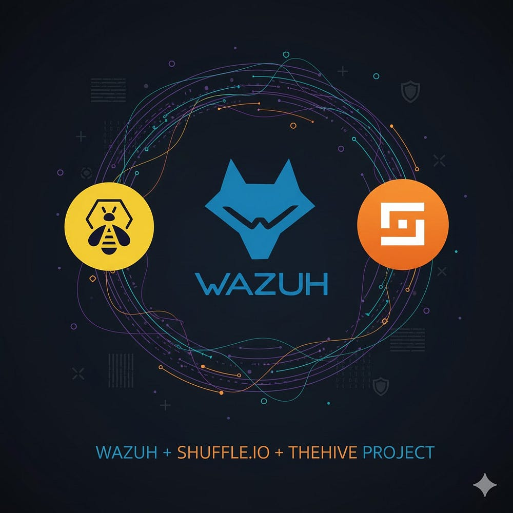

    

# Creating Automation for Wazuh
Scenario:
When Wazuh detects a malware alert, it automatically sends the event to TheHive to create a case, and Shuffle triggers a response workflow that enriches the alert with VirusTotal data and isolates the infected endpoint.

## Parts
- Part 1 :Setup the Environment
- 
