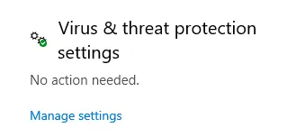
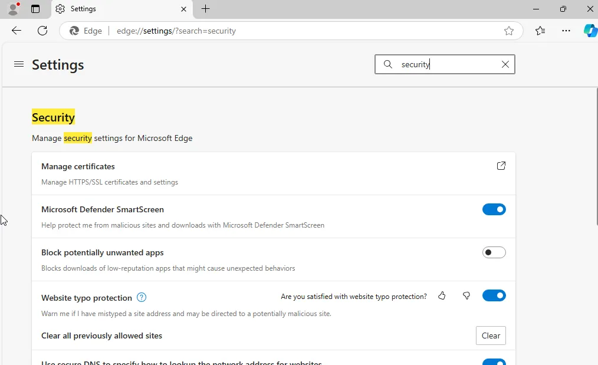
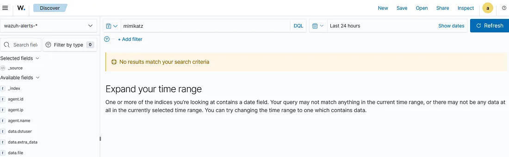
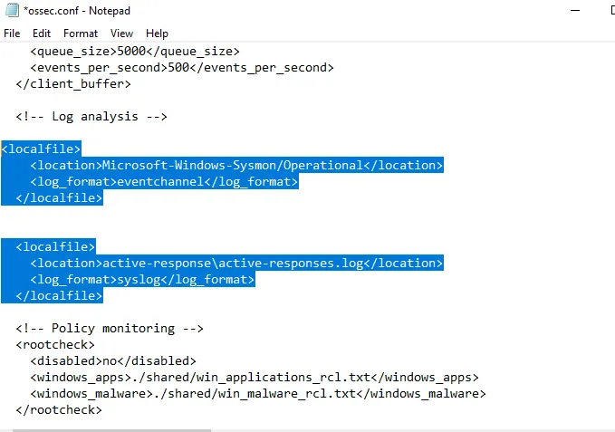
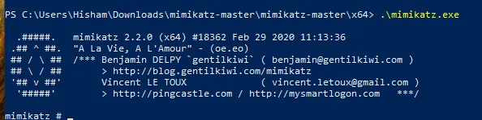

# Project part 2
Generate telemetry and ingest into wazuh

the first step to download mimikatz.exe to test the server, and to do this we need to switch off the windows deffender and the security options from the browser.
then we will make wazuh server to take all logs so we can analysis them. and wazuh by default don't do this so let's do it.
## On the windows agent:
open windows search bar >windows security>virus & threat protection
under virus & threat protection go to exclusions (add or remove exclusions) 
<p align="center">      </p>
if you couldn't find it >> then go to manage settings
<p align="center">      </p>
go down you will find it.
<p align="center">      </p>
select add an exclusion >directory > choose downloads directory 
<p align="center">      </p>
open mcrosoft edge > settings search for security and disable microsoft defender smart screen
<p align="center">      </p>
download mimikatz zip file
<p align="center">      </p>
extract the files and go inside it and choose x64
<p align="center">      </p>
open powershell in this directory then open it
<p align="center">      </p>

in wazuh server, we can't find mimikatz so
- we need sysmon logs 
- and to enable wazuh server to log everything
<p align="center">      </p>
so to the file down below with admin privilege

`notepad.exe C:\Program files (x86)\ossec-agent\ossec.conf`
but don't forget to take backup just in case.
<p align="center">      </p>


in log analysis remove the text down below.
<p align="center">      </p>
and we need to focus on sysmon for this project.
download sysmon and then enable it
<p align="center">      </p>
and to find sysmon name you need to open event viewer
<p align="center">      </p>
then go down till you see sysmon open the file and click left-click then choose properties to get the real place

<p align="center">      </p>
so the ossec.conf file should be like that 
<p align="center">      </p>
save and restart the service from services.

---

## In the server
with root priv.
```
cp /var/ossec/etc/ossec.conf /var/ossec/etc/ossec-backup
nano /var/ossec/etc/ossec.conf
```
<p align="center">      </p>
- change logall and logall_json to yes to log everything
- then restart wazuh manager

`systemctl restart wazuh-manager`
then wazuh will create archive all the logs in put them in a file called archive
<p align="center">      </p>
tip: ingest means the process of collecting and storing data from various sources for analysis and processing.
to make wazuh ingesting these logs and to do this we need to change configruation in filebeat

`nano /etc/filebeat/filebeat.yml`
<p align="center">      </p>
make archives true then restart filebeat

`systemctl restart filebeat.service`
## in wazuh server website:
<p align="center">      </p>
<p align="center">      </p>
We need to create index for archives so we can search all the logs regardless of wazuh trigger alert or not.
<p align="center">      </p>
<p align="center">      </p>
<p align="center">      </p>

- then press create index button

go to discover in the top left menu.
then choose our archives but remember maybe it will take minutes to load.
<p align="center">      </p>
and now we got the archives of all logs.
but if we got something wrong we can check the real archives
<p align="center">      </p>
we couldn't find mimikatz so we will try again to open mimikatz and we will check it again.
<p align="center">      </p>
you can also check from the windows itself with event 1 for process creation.
<p align="center">      </p>
then search you will find it .
look at the server again.
<p align="center">      </p>
now we can search for mimikatiz in our dashboard if you couldn't find it , you need to be patient. 

## in the server website
<p align="center">      </p>
we got it now we have 2 events we will check the original file name and the file creation event id (1) cause that will help us to trigger the alert.
<p align="center">      </p>
- **Tip: even the attacker rename mimikatz the original-file-name,it will be the same. if you focus on the image, then the attacker can rename the file and you will lose the detection.**

let's work on the alert.
## Rule Creation
go to rules from the top left corner
<p align="center">      </p>
then manage rules files then search for sysmon
0800-sysmon_id_1.xml
see this file using the eye
we will take a copy from this role and paste it in our local custom rules.
<p align="center">      </p>
press custom rules to get this screen then press on the pencil 
<p align="center">      </p>
<p align="center">      </p>
you should 
- change the id to make it unique
- the level to know how important is the alert. (15 is the maximum)
- field name and focus on case sensitivity.
- the file name itself
- description
- the mitre id => credential dumping T1003 id
<p align="center">      </p>
save and then restart the manager. from the button that will appear.
we are ready now…
<p align="center">      </p>

lets rename mimikatz and run it .
<p align="center">      </p>
<p align="center">      </p>
refresh the server website page 
<p align="center">      </p>
after you inspect the file from the left side in the event , you will see that the image is changed.
<p align="center">      </p>
but the original file name didn't change

<p align="center">      </p>
